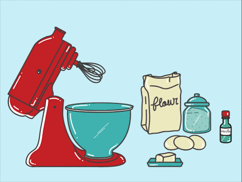
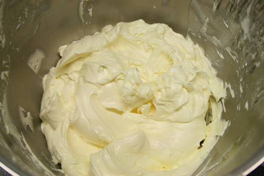
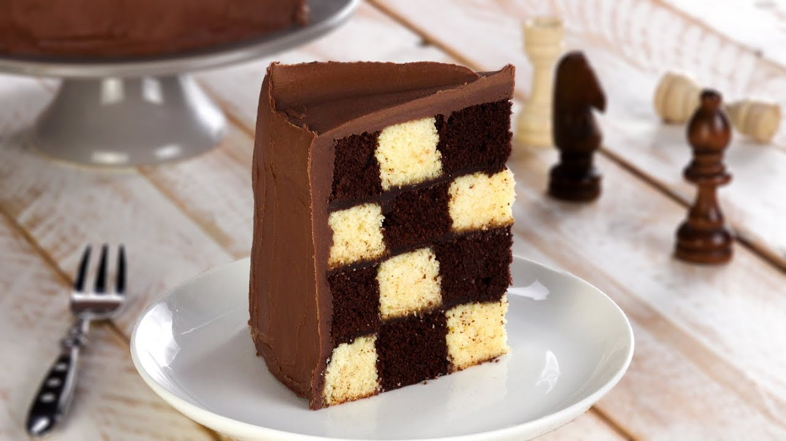

# COMO HACER UN PASTEL DE AJEDREZ

El pastel de ajedrez o pastel damero es original, delicioso por su combinación y muy atractivo a la vista internamente. En esta oportunidad te presentamos su versión tradicional de vainilla y chocolate, pero las combinaciones llegarán hasta donde tú lo quieras llevar. Prueba nuestra receta y disfruta de este vistoso postre

- **Preparación**: 30 minutos
- **Cocción:** 1 hora
- **Cantidad:** 6 - 8 Porciones
- **Dificultad:** Medio

## INGREDIENTES:

<table align="center">
<tr> 
    <td>
        <table class="default">
            <tr> <td> 500 g de margarina sin sal </td> </tr>
            <tr> <td> 450 g de azúcar pulverizada </td> </tr>
            <tr> <td> 8 Huevos </td> </tr>
            <tr> <td> 500 g de Harina todo uso </td> </tr>
            <tr> <td> 10 g de Polvo de hornear </td> </tr>
            <tr> <td> 1 cucharadita de esencia de vainilla </td> </tr>
            <tr> <td> 30 g de Cacao en polvo </td> </tr>    
        </table>
    </td>
    <td>
        
    </td>
</tr>
</table>

## PREPARACIÓN

<ul>
    <li> 1. Precalentar el horno a 175ºC. </li>
    
    <li> 2. Cremar la margarina hasta blanquear un poco. </li>
    
    <li> Cernir el azúcar pulverizada e incorporarla poco a poco. </li>
    <li> Batir la mezcla hasta que haya aumentado su volumen y tenga consistencia homogénea. </li>
    <li> Agregar los huevos uno a uno a velocidad media y al finalizar la esencia de vainilla. </li>
    <li> Cernir la harina junto al polvo de hornear e incorporar a mano en la mezcla anterior. </li>
    <li> Dividir la mezcla en partes iguales e incorporar a una de ellas el cacao en polvo. </li>
    <li> Disponer ambas mezclas en mangas individuales y proceder a manguear en aros dentro del molde. </li>
    <li> Alternar 2 discos iguales y otro de forma inversa para obtener el efecto - ajedrez. </li>
    <li> Hornear por 20 minutos aproximadamente cada disco de forma individual </li>
</ul>

## INFROMACIÓN NUTRICIONAL

<table align="center">
<tr> 
    <td>
        <table class="default">
            <tr> <td> Información nutricional </td>  <td> 1 porción </td></tr>
            <tr> <td> Energía </td> <td> 235 kcal </td></tr>
            <tr> <td> Proteína </td> <td> 2.62 g </td></tr>
            <tr> <td> Carbohidratos </td> <td> 34.94 g </td></tr>
            <tr> <td> Grasa </td> <td> 10.5 g </td></tr>
            <tr> <td> Colesterol </td> <td> 27 mg </td></tr>
            <tr> <td> Sodio </td> <td> 214 mg </td> </tr>    
            <tr> <td> Potasio </td> <td> 128 gr </td> </tr> 
        </table>
    </td>
    <td>
        
    </td>
</tr>
</table>

