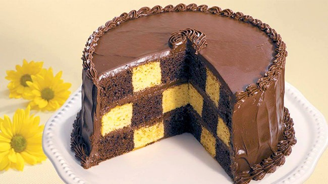

# COMO HACER UN PASTEL DE AJEDREZ

El pastel de ajedrez o pastel damero es original, delicioso por su combinación y muy atractivo a la vista internamente. En esta oportunidad te presentamos su versión tradicional de vainilla y chocolate, pero las combinaciones llegarán hasta donde tú lo quieras llevar. Prueba nuestra receta y disfruta de este vistoso postre

- **Preparación**: 30 minutos
- **Cocción:** 1 hora
- **Cantidad:** 6 - 8 Porciones
- **Dificultad:** Medio

## INGREDIENTES
||
|-------------|
| 500 g de margarina sin sal|
| 450 g de azúcar pulverizada   |
| 8 Huevos                      |
| 500 g de Harina todo uso      |
| 10 g de Polvo de hornear      |
| 1 cucharadita de esencia de vainilla |
| 30 g de Cacao en polvo        |

<table class="default">
    <tr> <td> 500 g de margarina sin sal </td> </tr>
    <tr> <td> 450 g de azúcar pulverizada </td> </tr>
    <tr> <td> 8 Huevos </td> </tr>
    <tr> <td> 500 g de Harina todo uso </td> </tr>
    <tr> <td> 10 g de Polvo de hornear </td> </tr>
    <tr> <td> 1 cucharadita de esencia de vainilla </td> </tr>
    <tr> <td> 30 g de Cacao en polvo </td> </tr>
    
</table>
## PREPARACIÓN

<!-- 
- 1.- Precalentar el horno a 175ºC.
- 2.- Cremar la margarina hasta blanquear un poco
- 3.- Cernir el azúcar pulverizada e incorporarla poco a poco
- 4.- Batir la mezcla hasta que haya aumentado su volumen y tenga consistencia homogénea.
- 5.- Agregar los huevos uno a uno a velocidad media y al finalizar la esencia de vainilla.
- 6.- Cernir la harina junto al polvo de hornear e incorporar a mano en la mezcla anterior.
- 7.- Dividir la mezcla en partes iguales e incorporar a una de ellas el cacao en polvo.
- 8.- Disponer ambas mezclas en mangas individuales y proceder a manguear en aros dentro del molde.
- 9.- Alternar 2 discos iguales y otro de forma inversa para que al armar las 3 capas y se obtenga el efecto - ajedrez.
- 10.- Hornear por 20 minutos aproximadamente cada disco de forma individual
-->

<ol>
    <li value="1"> Precalentar el horno a 175ºC. </li>
    <li> Cremar la margarina hasta blanquear un poco. </li>
    <li> Cernir el azúcar pulverizada e incorporarla poco a poco. </li>
    <li> Batir la mezcla hasta que haya aumentado su volumen y tenga consistencia homogénea. </li>
    <li> Agregar los huevos uno a uno a velocidad media y al finalizar la esencia de vainilla. </li>
    <li> Cernir la harina junto al polvo de hornear e incorporar a mano en la mezcla anterior. </li>
    <li> Dividir la mezcla en partes iguales e incorporar a una de ellas el cacao en polvo. </li>
    <li> Disponer ambas mezclas en mangas individuales y proceder a manguear en aros dentro del molde. </li>
    <li> Alternar 2 discos iguales y otro de forma inversa para obtener el efecto - ajedrez. </li>
    <li> Hornear por 20 minutos aproximadamente cada disco de forma individual </li>
</ol>
